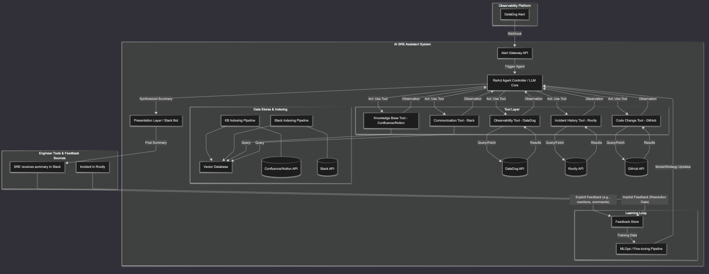

# AI SRE Assistant with ReAct Framework

This project proposes building an "AI SRE Assistant" using a ReAct (Reason + Act) agent framework. Triggered by an observability alert, this agent will autonomously reason about the situation, act by querying relevant data sources (tools), observe the results, and iteratively refine its investigation until it can synthesize a concise, actionable summary for the responding engineer. Furthermore, the system will be designed to learn from its history and feedback, continually improving its diagnostic strategies and the relevance of the information it provides.

## 1. Proposed System Architecture

The system is event-driven and centered around an LLM-powered ReAct agent that intelligently interacts with various tools to gather information dynamically.

### 1.1 High-Level Overview (ReAct Loop)

#### Alert Ingestion
- An endpoint receives alerts (e.g., DataDog webhook)

#### Agent Initialization
- The alert context (service, error type, time) is passed to the central ReAct Agent Controller / LLM Core

#### ReAct Cycle (Iterative)

##### Thought
- The LLM analyzes the current state (initial alert + previous observations)
- Reasons about the next best step or information needed

##### Act
- The LLM decides which Tool (e.g., DataDog Tool, GitHub Tool) to use and with what parameters
- It outputs this action request

##### Execution
- The Controller parses the action and invokes the specified Tool

##### Observation
- The Tool executes its task (querying APIs, databases)
- Returns the results (data, errors, confirmations) as an Observation

##### Update State
- The Observation is fed back into the LLM Core
- Updates context for the next Thought step

#### Loop Termination
- The loop continues until:
  - The LLM determines it has sufficient information
  - Reaches a predefined stop condition (e.g., max steps, time limit)
  - Encounters an unrecoverable error

#### Synthesis
- The LLM generates a final summary based on its internal reasoning trace and collected observations

#### Presentation
- The summary is delivered to the SRE (e.g., via Slack)

#### Feedback & Learning (Offline/Periodic)
- User feedback on summary usefulness is collected
- Subsequent incident resolution data is gathered
- Data is used to refine the agent's future performance:
  - Fine-tuning the LLM
  - Improving tool selection logic

### 1.2 Component Breakdown

#### Alert Gateway
- Receives external alerts
- Standardizes format
- Triggers the ReAct Agent Controller

#### ReAct Agent Controller / LLM Core
The central component orchestrating the ReAct loop:
- Manages interaction with the chosen LLM (e.g., OpenAI, Anthropic)
- Holds the agent's state (current context, history of thought-act-observation steps)
- Implements sophisticated Prompt Engineering templates for the ReAct cycle:
  - Reasoning
  - Action formulation
  - Summarization
- Parses the LLM's desired Act (tool name, parameters)
- Dispatches requests to the appropriate Tool
- Manages loop termination conditions
- Leverages learned strategies or fine-tuned models based on historical feedback

#### Tool Layer
A collection of callable tools with standardized interfaces the LLM can invoke. Each tool needs:
- Clear description
- Defined input parameters
- Predictable output formats

Tools include:
- **Observability Tool (DataDog)**: Interface to DataDog API (metrics, logs, traces, monitors)
- **Incident History Tool (Rootly)**: Interface to Rootly API (search past incidents)
- **Code Change Tool (GitHub)**: Interface to GitHub API (search commits/PRs)
- **Knowledge Base Tool (Confluence/Notion)**: Interface to query the Vector DB for documents
- **Communication Tool (Slack)**: Interface to query the Vector DB for conversations
- Potentially others:
  - Feature Flag Tool
  - Kubernetes API Tool
  - etc.

#### Vector Database & Indexing Pipelines
- Stores embeddings for KB/Slack
- Pipelines keep it updated

#### Feedback Store
A database to store:
- Explicit user feedback:
  - Thumbs up/down
  - Ratings on summary usefulness
  - Comments
- Implicit feedback:
  - Linking summary to resolved incidents in Rootly
  - Time-to-resolution

#### MLOps / Fine-tuning Pipeline
Offline processes that use data from the Feedback Store to:
- Fine-tune the core LLM used for ReAct to improve:
  - Reasoning
  - Tool selection strategy
- Improve embedding models for better retrieval relevance
- Refine ranking algorithms based on feedback

#### Presentation Layer
- Formats and delivers the final summary (e.g., Slack bot)

## System Architecture Diagram

## 2. Concerns and Risks

### Inherited Risks
- Data Access/Security
- Information Overload/Noise
- Accuracy/Hallucination
- Rate Limiting
- Maintenance Overhead
- Data Staleness
- Cost (potentially high due to more LLM calls)
- Adoption/Trust
- Contextual Understanding

### ReAct Specific Risks

#### Agent Looping/Wandering
- The agent might get stuck in unproductive loops
- Could explore irrelevant paths without strong guidance or stop conditions

#### Tool Usage Errors
- LLMs might try to use tools incorrectly:
  - Wrong parameters
  - Wrong tool for the job
- Requires robust error handling and potentially self-correction logic

#### Latency
- Each Thought-Act-Observation cycle adds latency
- Complex investigations might become too slow for real-time incident response

#### Prompt Injection/Manipulation
- Malicious content in data sources (e.g., a commit message) could potentially hijack the agent's reasoning if not handled carefully

#### Debugging Complexity
- Understanding why a ReAct agent made certain decisions can be challenging

#### Cost Control
- Unconstrained ReAct loops could lead to unexpectedly high LLM API costs